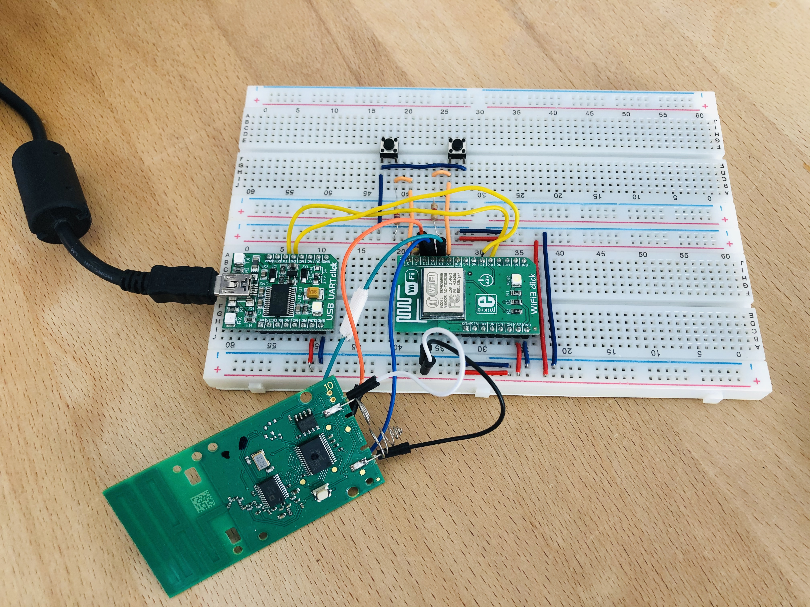
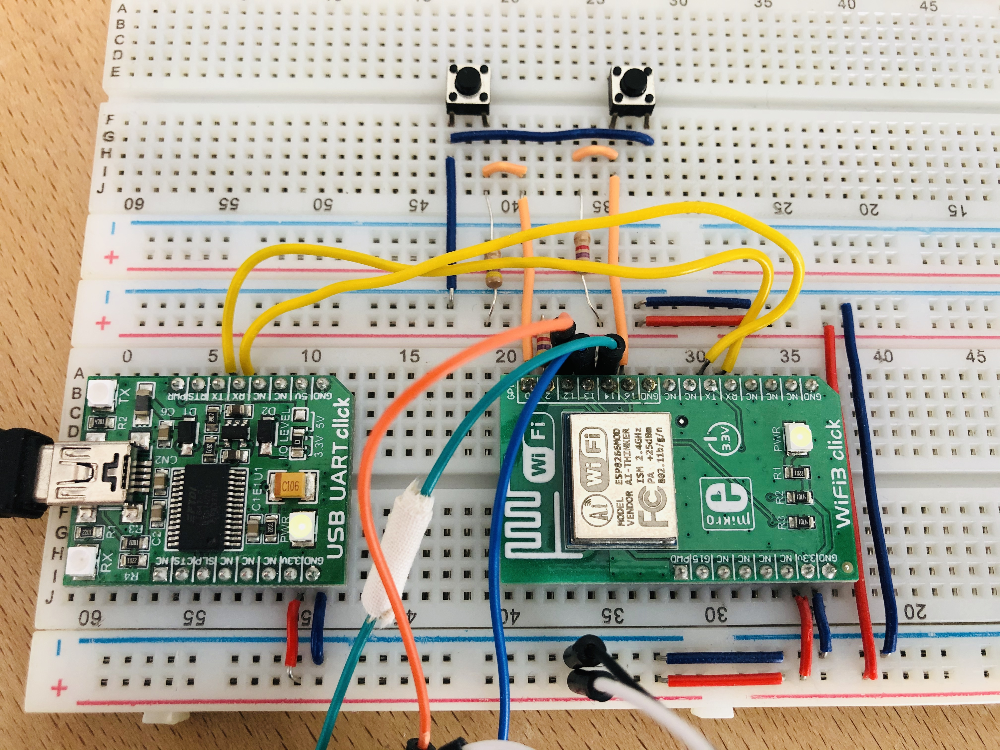
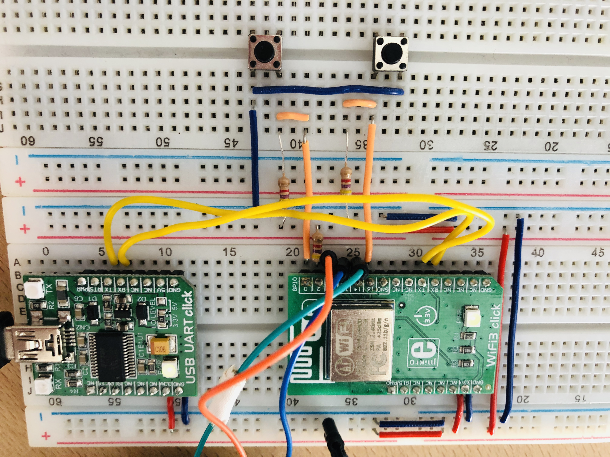
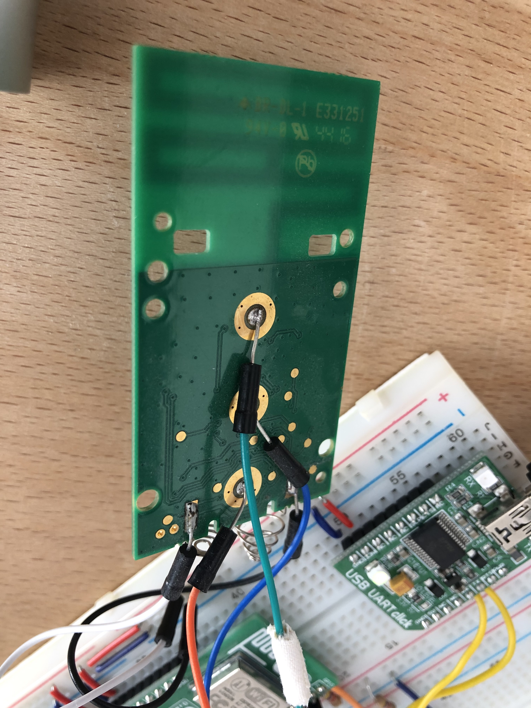
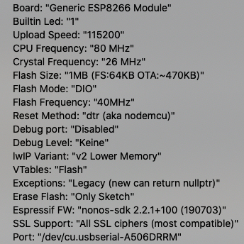
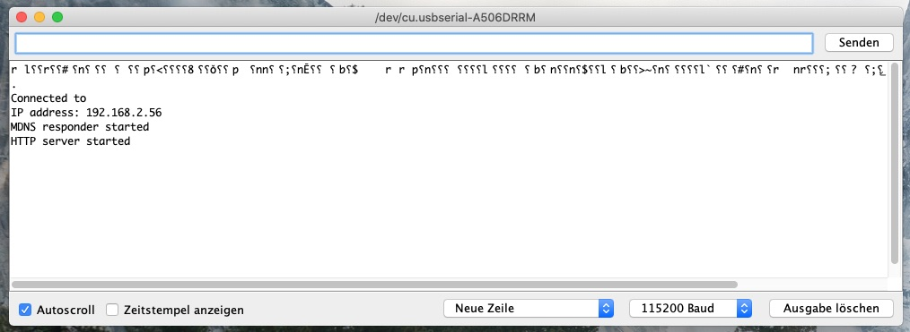

# RollerShutterFirmware: Firmware for an esp8266 to control VELUX INTEGRA shutters
Authors: Simon Bogutzky

License: [MIT](https://opensource.org/licenses/MIT)

Version: 1.0.0

Document version: 1.0.6 

Date: 12/04/2020

## What is the RollerShutterFirmware?
The RollerShutterFirmware is a firmware for an esp8266 to control for example VELUX INTEGRA via an integrated web server or the [RollerShutterApp](https://github.com/sbogutzky/RollerShutterApp/).

## Using the RollerShutterFirmware

### Hardware Installation Instructions
I use for the wireless connection a wireless click board [WiFi 3 click](https://amzn.to/2R5tHOT), based on the popular [ESP8266MOD](http://espressif.com/) chipset.

**Firmware Flashing Rig similar to [Hacking the Wifi3 Click](https://electronza.com/hacking-the-wifi3-click)**

I use one USB-UART click for communication and to provide 3.3V voltage from USB. In the pictures red wire is 3.3V, the blue wire is GND. The yellow wires are for UART communication. I  connect WiFi3 click RX pin to USB-UART TX pin and WiFi3 click TX pin to USB-UART RX pin. Pins GPIO0, GPIO2 and GPI16 have pull-up resistors to 3.3V. I use 4.7k for pull-ups. Two buttons are used to connect pins GPIO0 and GPIO16 to the ground. I open the remote of the VELUX INTEGRA shutters and add wires to the three buttons, to the power supply and the ground. The buttons are connected (up, green wire) to GPIO14, (stop, blue wire) to GPIO13 and (down, orange wire) to GPI012 of the WiFi3 click. Putting the WiFi 3 click into firmware download mode is made by connecting pin GPIO0 to the ground and rebooting ESP8266 by pressing the button connected to the GPI016 pin.



*Hardware overwiew*



*Hardware without remote*



*Hardware resistors*



*Velux Remote*

### Programming WiFi3 click in the Arduino IDE

Download the [Arduino IDE](https://www.arduino.cc/en/Main/Software). 

*I use macOS Catalina and the Version 1.8.12. The IDE uses Python and you have to create the right links to it. Type in the terminal:*

```
sudo ln -s /usr/bin/python3 /usr/local/bin/python3
sudo mkdir /usr/local/bin/
```
Arduino IDE offers support for ESP8266. All you have to do is to go to File / Preferences, and on Additional Boards Manager URL add “http://arduino.esp8266.com/stable/package_esp8266com_index.json”. In Arduino IDE, Tools, setup the communication to board (see my configuration in the picture). Do not forget to put the WiFi3 click into firmware download mode before uploading your code.



*Arduino IDE settings*

### Example Usage

Open the *.ino file and upload the firmware. Replace 

```
const char* ssid = "";
const char* password = "";
```

with your WiFi settings.


In the serial monitor you will see the IP address of the web server e. g. 192.168.2.56.



*Arduino serial monitor*

In your favorite browser you can type the following commands in the address bar:

```
http://192.168.2.56/up - for moving the shutters up
http://192.168.2.56/stop - for stopping the shutters
http://192.168.2.56/up - for moving the shutters down
http://192.168.2.56/version - getting the firmware version
```

You can also use the [RollerShutterApp](https://github.com/sbogutzky/RollerShutterApp/). Make sure you change the IP address in the source code of the plattform code.

## Author and Contribution
As by the License this is free software released by the Simon Bogutzky. The author (Simon Bogutzky) welcomes external contributors to freely use and extend this software. If you need some help, please write an [issue](https://github.com/sbogutzky/RollerShutterFirmware/issues).
